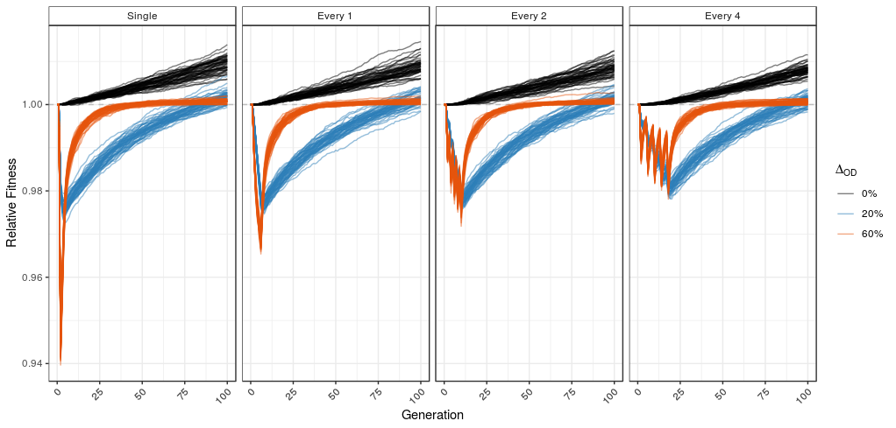

# Assisted-Gene-Flow


This repository contains the code for analysing the SimBit simulations we performed in the Whitlock lab for our Assisted Gene Flow project.

Remi ran a whole lot of simuations (hundreds of thousands) of sshort simulations modelling assisted gene flow as a means to acheive evolutionary rescue. We did a semi-factorial simulation design, with lots and lots of parameter combinations. This produced a whole heck of a lot of results files. The simulations were analysed using something like the following:

**Note, I haven't gone through and made sure all the relative paths etc. are correct. I'll do that once we finalise things a bit more.**
```
## Here's the pipeline that takes Remi's SimBit output and converts it into the files Dea uses to make the plots

Rscript --vanilla ../bin/convertRemiList.R paramGrid_A.0.6.txt paramGrid_A.0.6.csv

# Now make a directory to store the mean fitness and hybrid index for all parameter sets
mkdir summary

# Now get the means for each parameter set - THIS IS THE STEP THAT TAKES AGES!
parallel "sh ../bin/awk_mean.sh {}" ::: $(seq 1 XXX) 
 ### Where XXX is the number of parameter combinations that are inthe directory (58968 in this case!)
## The above will dump ***A LOT*** of summary files into the summary/ dir - (XXX x 2 ) files to be precise).

## DISCLAIMER!!!
## I neglected to check whether AWK is zero-indexed ... it is.
## Now I need to grab out the 0th generation from each parameter combination.
## This is because the fitnesses in the simulations are specified
## such that the maximum possible is 1.0, so a population can start with 
## a fitness <1 if positive selection is being modelled

## The following line of Awk-ish can get the 2nd line from each file, adding the file name at the beginning. I'll then read that into the parsing script and store it as a dictionary.
## Each parameter combination SHOULD have the exact same fitness in generation 0, as no selection has yet been imposed. I'll ponly store the first line  

awk 'FNR==2 {print FILENAME, $0}' outputs/A.0.6.*_1.fitStats > A.0.6_generation_0_fitnesses.txt
## This takes a few minutes


# Now take the means, and combine them into one big flipping file that can be used to explore parameter space... T
python ../bin/parseSimBitOutput_awkOutput.py --input summary/ --simbit paramGrid_A.0.6.csv --output A.0.6.output.csv --gen0 A.0.6_generation_0_fitnesses.txt

## The above will generate a file for each of the population sizes that were simulated.
## I send those to Dea and she then works her R magic to make beautiful plots

```
